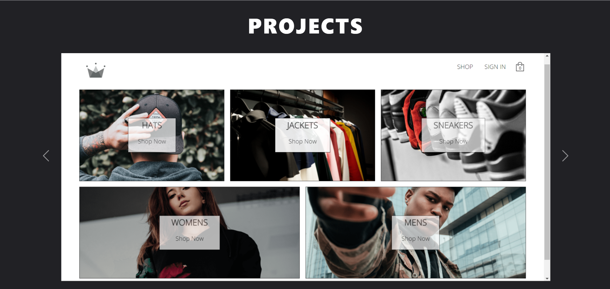
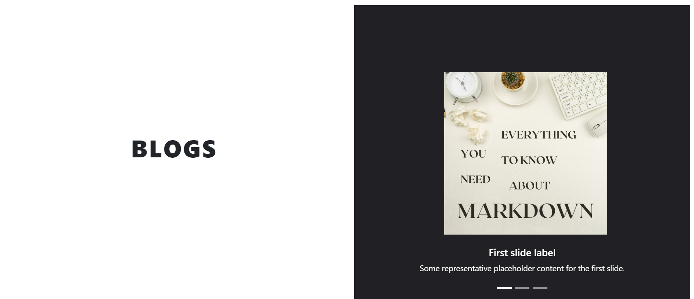

# Personal Portfolio

It consist of 3 sections 

## work Todo
- Add __RESPONSIVENESS__ to the portfolio

## Section 1 : Intro Section
>> This is the first section , here you can found an image of mine and the links of all my __socials__

## Section 2 : Projects Section
>> In this Section , there are 3 projects that i listed here in the form of carousel

### Work Todo here 
- add GitHub and live links to all my projects here 

## Section 3 : Blogs 
>> I like the idea of __LEARN IN PUBLIC__ , __SHARE IN PUBLIC__ and __ASK QUESTION IN PUBLIC__
> thats why I like to write technical blogs

### Work Todo here
- Add more Blogs and link to the blog

